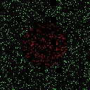
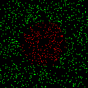

# neuralNet
Neural network in c++

### Classifying 2d points
First use of neural network using two hidden layers of size four and using ReLU for the hidden layers and sigmoid for the output layer.

 

*Training data and test data*

### Classifying minst database
First successful attempt at classifying the minst database. Hidden layer sizes of 256, 128 and 128. Sigmoid activation in hidden layers and softmax activation in output layer. Crossentropy loss function. The network was first run for a while without dropout and then with a dropout of 0.05. All training was done with a step size of 0.005.

</img>

*Input, output prediction and output expectation*
